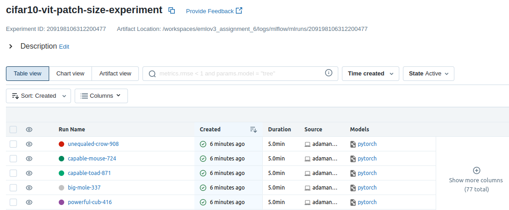
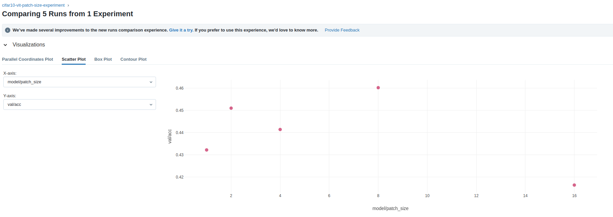
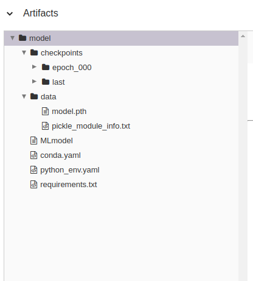
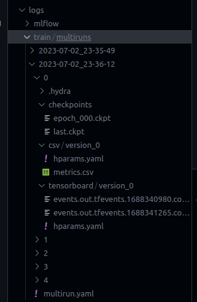

# EMLOv3 | Assignment 6

[](https://pytorch.org/get-started/locally/)
[](https://pytorchlightning.ai/)
[](https://hydra.cc/)
[](https://black.readthedocs.io/en/stable/)


## Adamantium 

<em>The name is inspired by the metal alloy which is bonded to the character Wolverine's skeleton and claws.</em>

Adamantium is a custom python package which currently supports:
- Usage of any model available in TIMM for training & evalution on CIFAR10 dataset. 
- VIT model for training, evaluation & inference on Cats-Dogs & CIFAR10 dataset.
- Experiment tracking using MLFlow, AIM, Tensorboard & CSV logger.

All functionalities can be controlled by hydra configs.

## DVC Setup

1. To track the all relevant folders using DVC, run the following command:

```bash
dvc add data logs .aim
```

2. To add the relevant folders to remote storage, run the following command:

```bash
dvc remote add -d local ../dvc_storage
```

3. To push the relevant folders to remote storage, run the following command:

```bash
dvc push -r local
```

4. To pull the relevant folders from remote storage, run the following command:

```bash
dvc pull -r local
```

## Docker Training

1. To build / pull the docker image, run the following command:

```bash
docker build -t salilgtm/emlov3_assignment_6 .
```

OR 

```bash
docker pull salilgtm/emlov3_assignment_6:latest
```

dockerhub link: https://hub.docker.com/r/salilgtm/emlov3_assignment_6

2. To run the docker image for training, run the following command:

```bash
docker run -it --expose 5000 -p 5000:5000 -v ${pwd}:/workspace --name adamantium-container salilgtm/emlov3_assignment_6 adamantium_train -m hydra/launcher=joblib hydra.launcher.n_jobs=5 experiment=cifar10 model.patch_size=1,2,4,8,16 data.num_workers=0
```

3. To run the MLFlow UI, run the following command:

```bash
docker exec -it -w /workspace/logs/mlflow adamantium-container mlflow ui --host 0.0.0.0
```

## Results

### MLFlow Runs


### patch_size vs val/acc


### Artifact Structure


### Logs Structure


## Past Documentation

- [Assignment 4](https://github.com/salil-gtm/emlov3_assignment_4)
- [Assignment 5](https://github.com/salil-gtm/emlov3_assignment_5)

## Author

- Salil Gautam